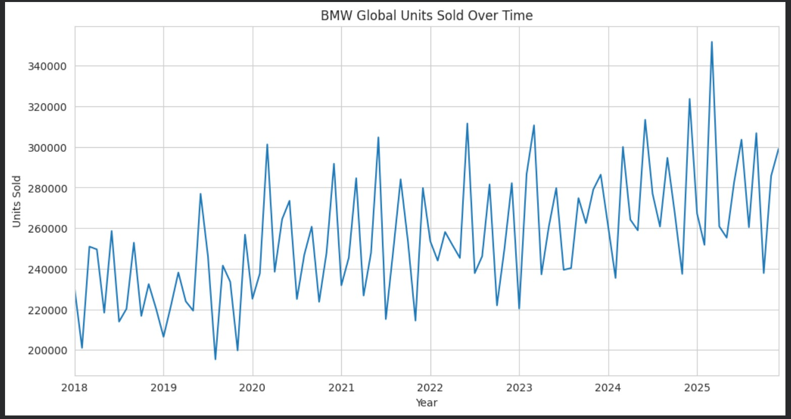
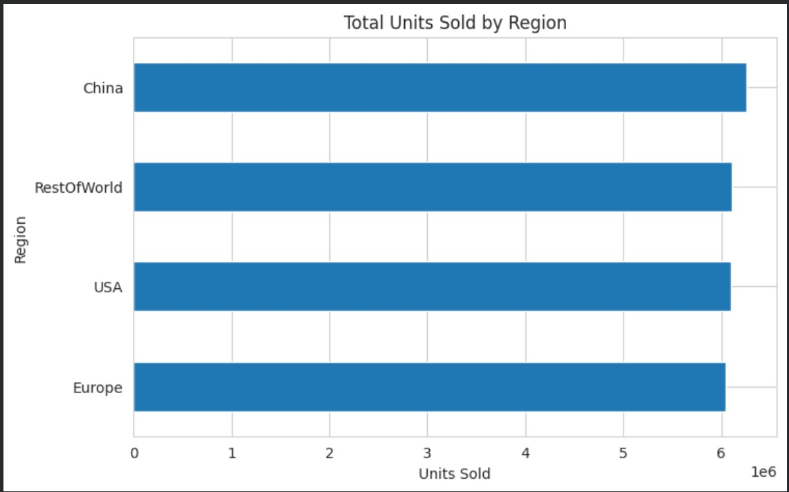
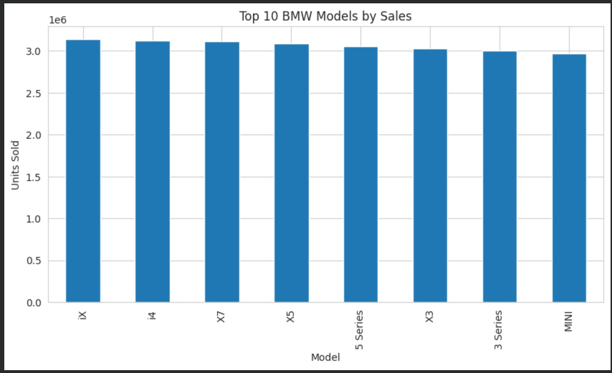
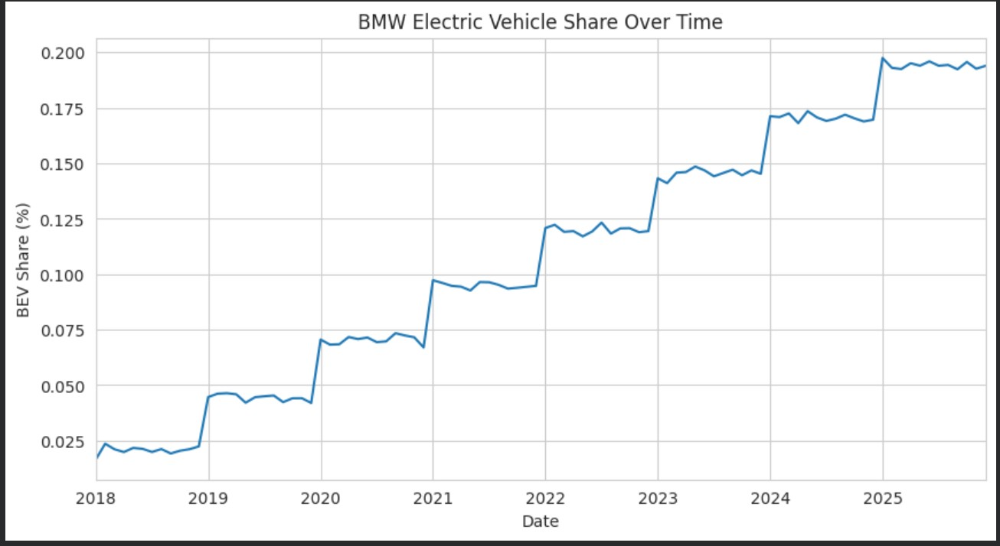
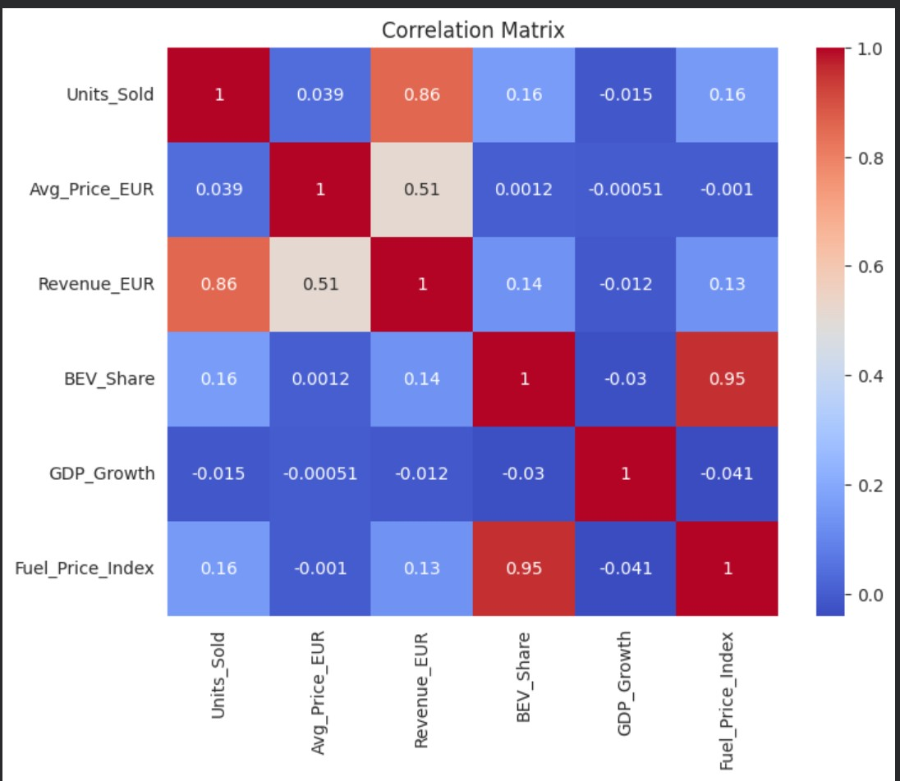

# BMW Global Sales & Electrification Analysis
##Live Interactive Dashboard
https://jessiejanev.github.io/BMW-Market-Sales-Data-Analysis/

## Project Overview

This project analyzes **BMW global sales data from 2018 to 2025** in order to identify key market trends, regional performance, and the growth of electric vehicles in the automotive industry.

The objective of this analysis is to demonstrate a **complete data analysis workflow using Python**, including:

* Data cleaning
* Exploratory Data Analysis (EDA)
* Data visualization
* Business insights extraction

The project also serves as a **portfolio case study for data analytics**, showcasing how raw data can be transformed into meaningful insights.

---

# Dataset

The dataset contains information related to BMW global performance, including:

* Units sold
* Revenue
* Average vehicle price
* Regional sales distribution
* Electric vehicle (BEV) share
* Macroeconomic indicators (GDP growth, fuel price index)

Time range analyzed:

**2018 – 2025**

---

# Tools Used

The analysis was conducted using the following tools and libraries:

* **Python**
* **Pandas**
* **NumPy**
* **Matplotlib**
* **Seaborn**
* **Google Colab**

These tools were used for data preprocessing, visualization, and exploratory data analysis.

---

# Data Analysis Process

The project follows a structured data analysis workflow:

### 1. Data Cleaning

* Checked for missing values
* Removed duplicates
* Verified correct data types
* Created time-based features for trend analysis

### 2. Exploratory Data Analysis

The dataset was explored to analyze:

* Global sales trends over time
* Regional sales distribution
* Model performance
* Electric vehicle adoption
* Correlations between economic variables and sales

### 3. Data Visualization

Visualizations were created to clearly communicate trends and insights.

---

# Key Insights

## Global Sales Trend

This visualization shows the evolution of BMW global sales over time, highlighting general growth patterns and fluctuations influenced by the automotive market.




---

## Regional Sales Distribution

The regional analysis reveals how different geographic markets contribute to BMW's global performance.




---

## Top Selling Models

This chart highlights the BMW models that generate the largest share of total vehicle sales.




---

## Electric Vehicle Adoption

The share of battery electric vehicles (BEV) has increased significantly over time, reflecting the global shift toward electrification in the automotive industry.

## Electric Vehicle Adoption



---

## Correlation Between Market Variables

The correlation matrix helps identify relationships between key variables such as sales, revenue, fuel prices, and macroeconomic indicators.



---

# Notebook

The full analysis, including data cleaning, exploration, and visualization, is available in the project notebook.

**Google Colab Notebook**

(https://colab.research.google.com/drive/1LMINJsDHcCutr7Uo2o2GPU0aWciwd9P5?usp=sharing)

---

# Project Structure

```
bmw-sales-electrification-analysis
│
├── data
│   └ bmw_global_sales_2018_2025.csv
│
├── notebook
│   └ bmw_analysis.ipynb
│
├── images
│   ├ sales_trend.jpg
│   ├ regional_sales.jpg
│   ├ top_models.jpg
│   ├ bev_share.jpg
│   └ correlation_matrix.jpg
│
└ README.md
```

---

# Author

This project was created as part of a **data analytics portfolio** to demonstrate data analysis skills using Python and business-oriented insights.
